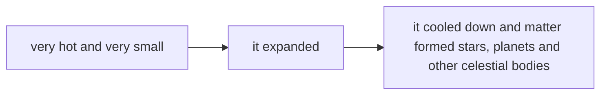

# The Universe

*Science - Class 5*

## THE UNIVERSE

The universe, or **cosmos**, is everything that exists:

- planets
- stars
- galaxies
- light
- matter
- energy and time

*Nel disegno originale: una nuvola che racchiude una galassia a spirale, la Terra e un pianeta con gli anelli - tutto cio' che esiste sta dentro il cosmo.*

## THE BIG BANG

Scientists think that the universe began with the **big bang** about **13.8 billion years ago**.

At the beginning, the universe was very hot and very small. Then it started to expand and cool down. Atoms formed and matter spread through space. Over time, this matter formed stars, planets and other celestial bodies.

The universe is still expanding today.

*La sequenza disegnata in fondo al cartellone.*

## HOW BIG IS THE UNIVERSE?

- We don't know the size of the whole universe.
- The observable universe is about **93 billion light-years** in diameter.
- A **light-year** is the distance that light travels in one year.
- The **universe is incredibly huge**: even travelling at the speed of light, it would take about **100,000 years** to cross our Milky Way galaxy!

|  | Size |
|---|---|
| Observable universe | ~ 93 billion light-years across |
| Milky Way (our galaxy) | ~ 100,000 years to cross at the speed of light |
| Whole universe | unknown |

*Nel disegno originale: un telescopio puntato verso un cerchio tratteggiato pieno di stelle - il telescopio vede solo l'universo osservabile, non tutto il cosmo.*

## KEYWORDS TO REMEMBER

big bang · 13.8 billion years ago · hot and small · expand · cool down · stars and planets · 93 billion light-years · milky way
